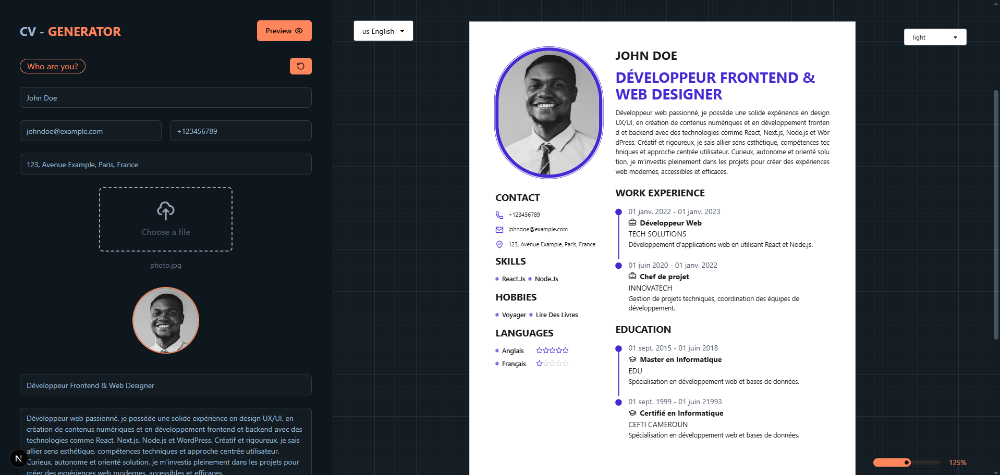

# 📄 CV-GENERATOR

Ein leistungsstarker, internationalisierter Lebenslauf-Generator, der mit **Next.js** entwickelt wurde. Dieses Tool ermöglicht es Benutzern, schnell und intuitiv ansprechende Lebensläufe zu erstellen, in mehreren Sprachen, mit verschiedenen Designoptionen und PDF-Export.



## 🌍 Funktionen

- 🌐 **Internationalisierung** mit [`next-intl`](https://github.com/amannn/next-intl)
- 🎨 Stilisiert mit **Tailwind CSS** & **daisyUI**
- 🎆 Feierliche Animationen mit `canvas-confetti`
- 🎯 Dynamisches Styling mit `clsx`
- 🖼️ Screenshot-Erstellung mit `html2canvas-pro`
- 📄 PDF-Export mit `jspdf`
- 💡 Icons von `lucide-react`
- ⚡ Echtzeit-Vorschau des Lebenslaufs beim Ausfüllen

---

## 🚀 Technologien

| Technologie        | Beschreibung                                           |
|--------------------|--------------------------------------------------------|
| **Next.js**        | React-basiertes Framework für serverseitiges Rendering |
| **next-intl**      | Mehrsprachigkeit & Lokalisierung                       |
| **Tailwind CSS**   | Utility-first CSS-Framework                            |
| **daisyUI**        | UI-Komponenten für Tailwind                            |
| **canvas-confetti**| Konfetti-Animationen beim Speichern                    |
| **clsx**           | Dynamisches Klassenzuordnen                            |
| **html2canvas-pro**| Konvertiert DOM zu Bildern                             |
| **jspdf**          | PDF-Dateien direkt aus dem Browser generieren          |
| **lucide-react**   | Schlichte, elegante SVG-Icons                          |

---

## 🛠️ Installation

```bash
git clone https://github.com/makombengas/cv-generator.git
cd cv-generator
npm install
npm run dev
